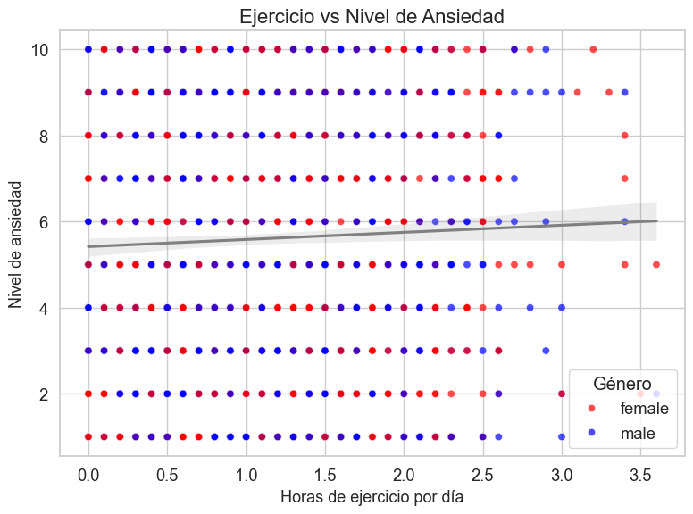
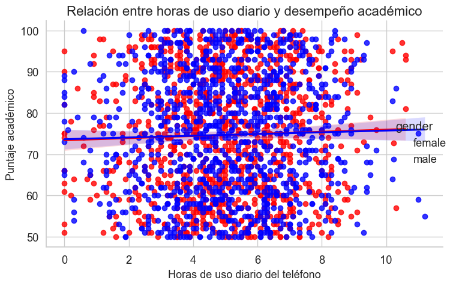
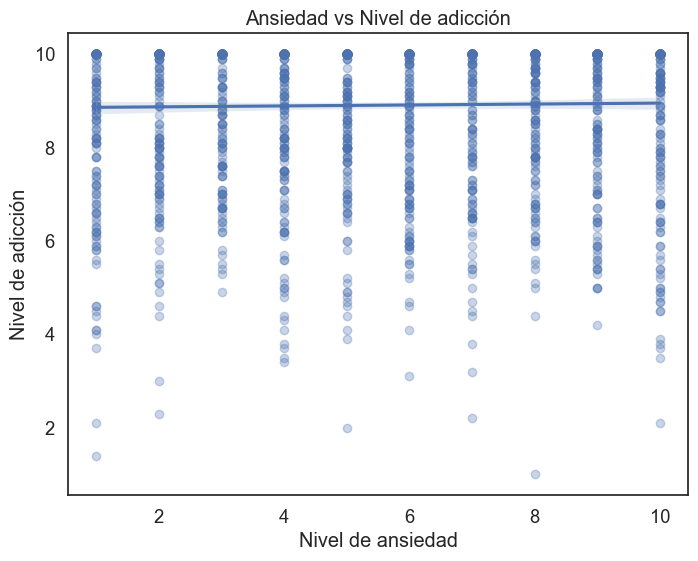

# Ejercicio-practico-semana-3---Grupo-7

Repositorio del trabajo práctico grupal de análisis de datos. Incluye selección de dataset, limpieza, EDA, visualizaciones y documentación de hallazgos. Todo el proceso está centralizado y coordinado en este repositorio como entregable final.

---

## Descripción del propósito del dataset:

Se seleccionó el dataset "Teen Smartphone Usage and Addiction Impact Dataset" debido a la creciente relevancia del uso de smartphones en la vida cotidiana, especialmente entre los adolescentes. En la actualidad, los dispositivos móviles no solo son una herramienta de comunicación, sino también una fuente de entretenimiento, socialización, educación e incluso dependencia emocional.

Este dataset permite abordar un problema contemporáneo de alto impacto social: la adicción al teléfono móvil en jóvenes. A través del análisis de variables como el tiempo de uso, las actividades más frecuentes, los hábitos relacionados con el sueño y el comportamiento en redes sociales, es posible obtener insights significativos sobre los patrones de uso y su posible relación con factores psicológicos y conductuales.

Además, este conjunto de datos ofrece una base sólida para realizar un análisis exploratorio detallado, construir visualizaciones informativas y, potencialmente, aplicar modelos predictivos. Su riqueza y diversidad de variables lo convierten en una excelente opción para generar argumentos con sustento analítico y reflexionar sobre uno de los fenómenos más relevantes de la era digital.

---

## Explicación de los pasos de limpieza y transformación:

### Limpieza y Transformación del Dataset

Para asegurar la calidad y consistencia del dataset seleccionado, se llevaron a cabo los siguientes pasos de limpieza y transformación:

1. **Selección de columnas relevantes**  
   Se eliminaron columnas que no aportaban valor al análisis, específicamente ID y Name, para centrar el estudio en variables de interés como edad, género, horas de uso diario, niveles de ansiedad, rendimiento académico, entre otras.

2. **Estandarización de nombres de columnas**  
   Los nombres de las columnas se transformaron a minúsculas y se reemplazaron espacios por guiones bajos para facilitar su manejo en Python y asegurar consistencia durante el análisis.

3. **Limpieza y filtrado de valores categóricos**  
   La columna gender se revisó para detectar inconsistencias. Se estandarizaron los valores a minúsculas y se filtraron las categorías para conservar únicamente los registros correspondientes a los géneros masculino (male) y femenino (female), eliminando otros valores para focalizar el análisis.

4. **Verificación de valores nulos y duplicados**  
   Se comprobó que no existieran valores nulos ni registros duplicados, garantizando la integridad del dataset.

5. **Validación de rangos y distribución de variables numéricas**  
   Se revisaron los rangos de las variables numéricas para asegurar que fueran coherentes con la población y contexto de estudio (adolescentes). Por ejemplo, edades entre 13 y 19 años, horas de sueño y uso de dispositivos dentro de límites plausibles.

6. **Preparación para análisis exploratorio**  
   Finalmente, el dataset limpio y transformado fue preparado para el análisis exploratorio, manteniendo variables numéricas y categóricas relevantes para la investigación sobre la adicción al teléfono móvil en adolescentes.

---
## Visualizaciones Clave del Dataset

### Ejercicio vs Nivel de Ansiedad

Este gráfico analiza la relación entre las horas de ejercicio físico realizadas diariamente por los adolescentes y su nivel de ansiedad. Se evidencia una tendencia general en la que quienes hacen más ejercicio tienden a reportar niveles de ansiedad más bajos. Esto sugiere que la actividad física puede tener un efecto positivo sobre la salud mental, actuando como un posible factor protector frente a la ansiedad.

### Relación entre horas de uso diario y desempeño académico

Se observa una tendencia negativa entre el tiempo de uso diario del smartphone y el rendimiento académico de los adolescentes. A mayor número de horas frente al dispositivo, menor tiende a ser el desempeño escolar.

Esto sugiere que el uso excesivo del teléfono puede interferir con las actividades académicas, ya sea por distracción, fatiga, o reducción del tiempo dedicado al estudio.

### Relación entre ansiedad y nivel de adicción al smartphone

Este gráfico muestra cómo se relacionan los niveles de ansiedad con el grado de adicción al teléfono móvil en adolescentes. Se observa una correlación positiva: a mayor nivel de ansiedad, también tiende a aumentar el nivel de adicción. Esto sugiere que el uso excesivo del smartphone puede ser una forma de escape emocional o que la ansiedad impulsa un uso más compulsivo del dispositivo, generando un ciclo difícil de romper.

---

📌 **Nota**: Para una exploración más detallada de los datos, el análisis completo con código, visualizaciones interactivas y justificaciones se encuentra disponible en el notebook [`Ejercicio_practico.ipynb`](Ejercicio_practico.ipynb). Allí se profundiza en cada variable, correlación y posible insight relevante del dataset.

---
## Principales hallazgos del análisis:

### Relación entre horas de ejercicio y nivel de ansiedad
- Se observa una relación inversa entre las horas de ejercicio diario y el nivel de ansiedad en adolescentes.  
- Los jóvenes que realizan más ejercicio tienden a presentar niveles de ansiedad más bajos, lo que sugiere un posible efecto protector de la actividad física sobre la salud mental.

### Relación entre horas diarias de uso de smartphone y desempeño académico
- El análisis muestra una tendencia negativa entre el tiempo dedicado al uso del teléfono y el rendimiento académico.  
- Adolescentes con mayor uso diario del smartphone suelen tener un desempeño académico menor, evidenciando un posible impacto negativo del uso excesivo.

### Ansiedad vs nivel de adicción al teléfono
- Los niveles de ansiedad y el grado de adicción al smartphone están positivamente correlacionados.  
- Mayores niveles de ansiedad coinciden con un mayor nivel de adicción, lo que podría indicar un círculo vicioso donde la ansiedad aumenta el uso problemático del teléfono y viceversa.

---

## Insight o conclusión relevante:

### ¿Qué influye más en el rendimiento académico?

De las variables analizadas, el **tiempo de uso diario del smartphone** parece tener una influencia más directa y significativa sobre el rendimiento académico que otros factores como la ansiedad o el ejercicio. Limitar el uso excesivo del teléfono podría mejorar el desempeño escolar. 

Sin embargo, factores psicológicos como la ansiedad también juegan un rol importante, ya que se relacionan con la adicción al dispositivo, y esta adicción puede afectar indirectamente el rendimiento. 

Por tanto, para mejorar el rendimiento académico en adolescentes, es clave abordar tanto la **gestión del tiempo frente a dispositivos digitales** como el **bienestar emocional**, promoviendo hábitos saludables de ejercicio y control del estrés.

---

## Fuente del dataset:

El dataset utilizado fue obtenido de Kaggle:  
[Teen Smartphone Usage and Addiction Impact Dataset](https://www.kaggle.com/datasets/sumedh1507/teen-phone-addiction/data)

---
